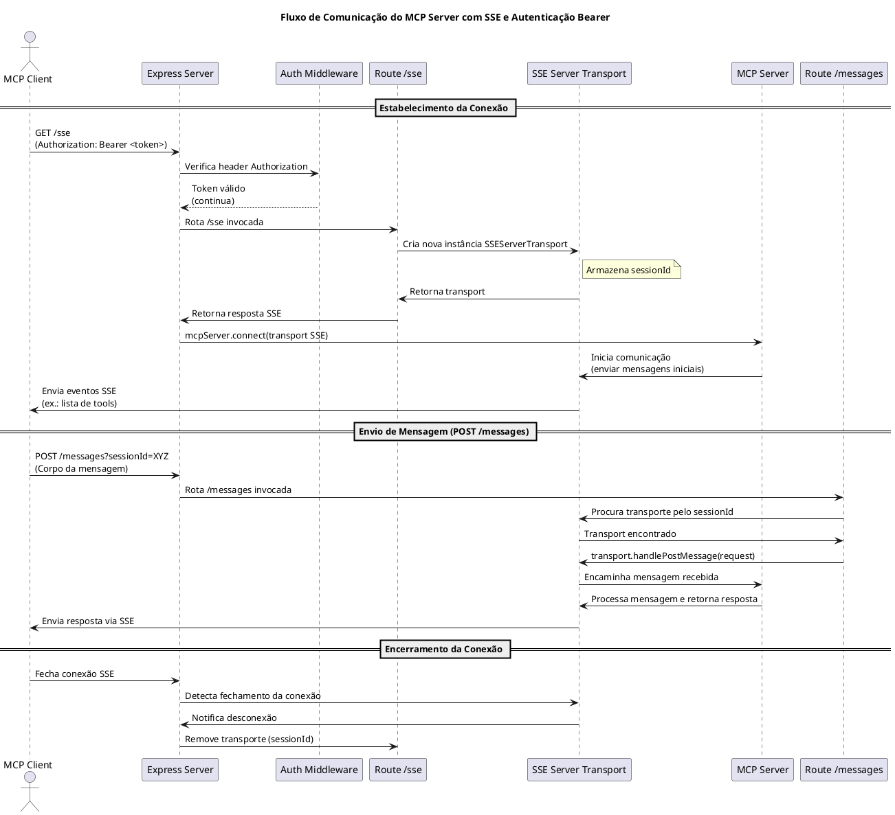

# MCP Server com SSE e Autenticação Bearer

[](https://github.com/br-silvano/mcp-sse/actions/workflows/build.yml)

Este projeto é uma implementação de um **MCP Server** (Model Context Protocol) construído em **TypeScript**. Ele utiliza **Server-Sent Events (SSE)** para o transporte remoto de mensagens e autenticação baseada em **Bearer Token**, permitindo a comunicação segura e em tempo real com clientes, como hosts de LLM (ex.: Claude Desktop).

---

## Índice

- [Visão Geral](#visao-geral)
- [Arquitetura](#arquitetura)
- [Recursos e Funcionalidades](#recursos-e-funcionalidades)
- [Requisitos](#requisitos)
- [Instalação e Configuração](#instalao-e-configuracao)
- [Execução](#execucao)
- [Diagrama de Sequência](#diagrama-de-sequencia)
- [Contribuição](#contribuicao)
- [Licença](#licenca)

---

## Visão Geral <a href="#visao-geral"></a>

Este projeto implementa um servidor MCP que expõe ferramentas (tools) para serem chamadas via protocolo MCP, utilizando SSE para comunicação em tempo real e autenticando requisições através de um token Bearer.
<a href="https://modelcontext.org" target="_blank" rel="noopener noreferrer">Saiba mais sobre o protocolo MCP no site oficial</a>

---

## Arquitetura <a href="#arquitetura"></a>

A arquitetura do projeto é composta pelos seguintes módulos:

- **MCP Module:** Responsável pela criação e configuração do servidor MCP, incluindo o registro de ferramentas.
- **Middlewares:** Inclui o middleware de autenticação (Bearer Token) e o middleware condicional para o processamento de JSON, garantindo que o fluxo de dados no endpoint `/messages` não seja consumido indevidamente.
- **Rotas:** Define os endpoints do Express para estabelecer a conexão SSE (`/sse`) e para a recepção de mensagens (`/messages`).
- **Config:** Armazena configurações como token de autenticação e porta do servidor.
- **App:** Centraliza a configuração do Express, integração dos middlewares e rotas, e o início do servidor.

---

## Recursos e Funcionalidades <a href="#recursos-e-funcionalidades"></a>

- **Transporte SSE:** Conexão remota em tempo real usando Server-Sent Events.
- **Autenticação Bearer:** Verificação de segurança via token fornecido no header `Authorization`.
- **Ferramenta de Exemplo:** Uma ferramenta simples que realiza a soma de dois números, demonstrando a estrutura de registro e execução de tools no MCP Server.
- **Estrutura Modular:** Separação de responsabilidades conforme os princípios SOLID e Clean Code.
- **Desenvolvimento com ts-node:** Execução direta dos arquivos TypeScript sem necessidade de pré-compilação (ideal para desenvolvimento e debugging).

---

## Requisitos <a href="#requisitos"></a>

- **Node.js** (versão 20 ou superior)
- **npm**
- **TypeScript**
- **ts-node** (para desenvolvimento)
- Ambiente compatível com WSL (se aplicável)

---

## Instalação e Configuração <a href="#instalao-e-configuracao"></a>

1. **Clone o repositório:**

   ```bash
   git clone <URL_DO_REPOSITORIO>
   cd mcp-sse
   ```

2. **Instale as dependências:**

   ```bash
   npm install
   ```

3. **Configuração:**

   - **Token de Autenticação:**
     Crie um arquivo `.env` na raiz do projeto e defina o token Bearer:

     ```txt
     BEARER_TOKEN=meu-token-secreto
     PORT=3001
     ```

   - O projeto utiliza variáveis de ambiente para carregar essas configurações em runtime.

---

## Execução <a href="#execucao"></a>

### Usando `ts-node`

Durante o desenvolvimento, é possível executar o servidor sem pré-compilá-lo:

```bash
npm run dev
```

> ℹ️ _Nota: o script `"start"` no `package.json` está configurado para uso com `node` e exige build prévio via `tsc`._

---

### Usando `@modelcontextprotocol/inspector`

Para visualizar e testar as ferramentas MCP em tempo real via interface web, execute:

```bash
npm run dev:inspect
```

> 💡 Esse comando utiliza `ts-node` para rodar o projeto sem build prévio.
> 🔐 A interface ficará disponível em: [http://127.0.0.1:6274](http://127.0.0.1:6274)

---

### Build e Execução em Produção

Para compilar os arquivos TypeScript:

```bash
npm run build
```

Depois, execute a versão compilada:

```bash
node dist/index.js
```

## Diagrama de Sequência <a href="#diagrama-de-sequencia"></a>

O fluxo de comunicação e uso do MCP Server está ilustrado no diagrama abaixo:



_Nome Recomendado: "Diagrama de Sequência - Fluxo de Comunicação do MCP Server com SSE e Autenticação Bearer"._

---

## Contribuição <a href="#contribuicao"></a>

Contribuições são bem-vindas! Se você deseja melhorar este projeto:

1. Faça um fork e clone o repositório.
2. Crie uma branch para a sua feature ou correção.
3. Submeta um Pull Request com suas alterações, seguindo as diretrizes de código e mantendo os princípios SOLID e Clean Code.

---

## Licença <a href="#licenca"></a>

Este projeto está licenciado sob a [MIT License](LICENSE).

---

*Documentação atualizada em 14/04/2025.*
